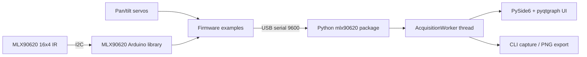

# MLX90620 Thermal Camera

Arduino Uno firmware and a **Python** host app for the Melexis **MLX90620** 16×4 infrared array.

This project was carried out as part of the Supélec engineering curriculum (*Projet de Conception*, Sequence 8) between April and June 2015 by **Alexandre Loeblein Heinen** and **Clyvian Ribeiro Borges** (Binôme A6.66), supervised by José Picheral. The 2026 modernization adds a coherent library API, PlatformIO builds, CI artifacts, English documentation, and a Python host (PySide6 + pyqtgraph) that replaces the original MATLAB GUIDE UIs.

## Features

- Object-oriented **MLX90620** Arduino library (EEPROM calibration, ambient/object temperature, serial framing)
- **Realtime** sketch: stream 64 temperatures/frame at a configurable refresh rate
- **Scan** sketch: dual-servo mosaic with frame markers for host reconstruction
- Python host: serial acquisition, median filtering, demo mode, CLI, and dual-heatmap GUI
- Hardware-free **demo mode** for UI/CI checks (`--demo` or `MLX90620_DEMO=1`)

## Architecture



## Requirements

- Arduino Uno + MLX90620 on I2C (optional servos on pins 9 and 11 for scan)
- [PlatformIO Core](https://platformio.org/) (recommended) or Arduino IDE
- Python 3.11+ (`pip install -e python/[gui]`)

## Quick start

```bash
# Compile both firmware examples
make build

# Python host (demo, no Arduino)
cd python && python -m pip install -e ".[dev]"
mlx90620 capture --demo --frames 1 --output /tmp/frame.png
mlx90620 gui --demo
```

Full wiring, upload, and serial-protocol details: [docs/BUILD.md](docs/BUILD.md).

## Repository layout

```text
firmware/lib/MLX90620/     First-party sensor library
firmware/external/         Vendored I2Cmaster (GPL-3)
firmware/examples/         realtime and scan sketches (+ PlatformIO projects)
python/                    Host package (CLI + GUI)
docs/                      Markdown docs + archived French PDFs / MATLAB tree
scripts/                   format, lint, artifact helpers
```

## Documentation

| File | Purpose |
|------|---------|
| [README.md](README.md) | Quick start (this file) |
| [docs/BUILD.md](docs/BUILD.md) | Build, upload, serial protocol, Python host |
| [docs/USER_GUIDE.md](docs/USER_GUIDE.md) | Operator guide (English) |
| [docs/REPORT.md](docs/REPORT.md) | Project report (English) |
| [CONTRIBUTING.md](CONTRIBUTING.md) | Code standards |
| [docs/AGENTS.md](docs/AGENTS.md) | Checklist for AI coding assistants |
| [docs/MODERNIZATION_PLAN.md](docs/MODERNIZATION_PLAN.md) | Modernization roadmap |
| [docs/python-migration-analysis.md](docs/python-migration-analysis.md) | Why/how MATLAB was replaced |
| [docs/archive/](docs/archive/) | Original French PDFs + archived MATLAB host |

## Continuous integration

GitHub Actions builds both PlatformIO environments, runs Black/Ruff/pytest on the Python host (plus an offscreen GUI smoke test), and uploads firmware hex artifacts and demo PNG frames.

## License

This project is released under the [GNU GPL v3](LICENSE). The vendored I2C master library is also GPL-3; see [THIRD_PARTY_NOTICES.md](THIRD_PARTY_NOTICES.md).
