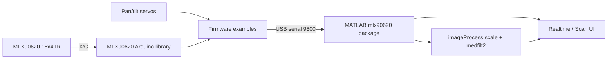

# MLX90620 Thermal Camera

Arduino Uno firmware and MATLAB GUIs for the Melexis **MLX90620** 16×4 infrared array.

This project was carried out as part of the Supélec engineering curriculum (*Projet de Conception*, Sequence 8) between April and June 2015 by **Alexandre Loeblein Heinen** and **Clyvian Ribeiro Borges** (Binôme A6.66), supervised by José Picheral. The 2026 modernization adds a coherent library API, PlatformIO builds, CI artifacts, English documentation, and MATLAB `serialport` helpers — see [docs/MODERNIZATION_PLAN.md](docs/MODERNIZATION_PLAN.md).

## Features

- Object-oriented **MLX90620** Arduino library (EEPROM calibration, ambient/object temperature, serial framing)
- **Realtime** sketch: stream 64 temperatures/frame at a configurable refresh rate
- **Scan** sketch: dual-servo mosaic with frame markers for MATLAB reconstruction
- MATLAB GUIDE interfaces with scale + median filtering (`mlx90620.imageProcess`)
- Hardware-free **demo mode** for UI checks (`MLX90620_DEMO=1`)

## Architecture



## Requirements

- Arduino Uno + MLX90620 on I2C (optional servos on pins 9 and 11 for scan)
- [PlatformIO Core](https://platformio.org/) (recommended) or Arduino IDE
- MATLAB R2019b+ with Image Processing Toolbox (`serialport`, `medfilt2`)

## Quick start

```bash
# Compile both firmware examples
make build
# or: pio run -d firmware/examples/realtime && pio run -d firmware/examples/scan
```

```matlab
cd matlab
setupPaths
setenv('MLX90620_DEMO','1')   % optional: no Arduino required
% open realtime/interface.m or scan/interface.m
```

Full wiring, upload, and serial-protocol details: [docs/BUILD.md](docs/BUILD.md).

## Repository layout

```text
firmware/lib/MLX90620/     First-party sensor library
firmware/external/         Vendored I2Cmaster (GPL-3)
firmware/examples/         realtime and scan sketches (+ PlatformIO projects)
matlab/+mlx90620/          Shared MATLAB helpers (serial, filter, demo)
matlab/realtime/           Realtime GUIDE UI
matlab/scan/               Scan / mosaic GUIDE UI
docs/                      Markdown docs + archived French PDFs
scripts/                   format, lint, artifact helpers
```

## Documentation

| File | Purpose |
|------|---------|
| [README.md](README.md) | Quick start (this file) |
| [docs/BUILD.md](docs/BUILD.md) | Build, upload, serial protocol |
| [docs/USER_GUIDE.md](docs/USER_GUIDE.md) | Operator guide (English) |
| [docs/REPORT.md](docs/REPORT.md) | Project report (English) |
| [CONTRIBUTING.md](CONTRIBUTING.md) | Code standards |
| [docs/AGENTS.md](docs/AGENTS.md) | Checklist for AI coding assistants |
| [docs/MODERNIZATION_PLAN.md](docs/MODERNIZATION_PLAN.md) | Modernization roadmap |
| [docs/archive/](docs/archive/) | Original French PDF report and user guide |

## Continuous integration

GitHub Actions builds both PlatformIO environments, runs `clang-format` + MISS_HIT checks, and uploads `.hex` / `.elf` artifacts plus size and hex-preview reports on every push and pull request to `master`.

## License

This project is released under the [GNU GPL v3](LICENSE). The vendored I2C master library is also GPL-3; see [THIRD_PARTY_NOTICES.md](THIRD_PARTY_NOTICES.md).
