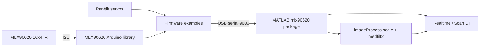

# Modernization Plan: MLX90620 Thermal Camera Project

> **Project:** Supélec *Projet de Conception* (Sequence 8), April–June 2015  
> **Authors:** Alexandre Loeblein Heinen & Clyvian Ribeiro Borges (Binôme A6.66)  
> **Repository:** [alexandrelheinen/mlx90620](https://github.com/alexandrelheinen/mlx90620)  
> **Reference modernizations:** [super-sprint](https://github.com/alexandrelheinen/super-sprint), [vector-view](https://github.com/alexandrelheinen/vector-view)

This document is the living plan for bringing the 2015 Arduino + MATLAB thermal-camera project up to the same documentation, build, and code-quality bar as the other modernized student projects. Phases are ordered by risk reduction; each phase should be independently mergeable.

---

## 0. Current state (audit summary)

### What the project is

An Arduino Uno firmware + MATLAB GUIDE GUI pair that drives a Melexis **MLX90620** 16×4 IR array, optionally pans it with two servos (scan / *balayage* mode), streams temperatures over serial, and displays raw + median-filtered heatmaps in MATLAB.

| Area | Contents today |
|------|----------------|
| Firmware | Two sketches (`Sensor64_balayage`, `Sensor64_tempsreel`) + `MLX90620` library + vendored `I2Cmaster` (Peter Fleury / DSSCircuits, **GPL-3**) |
| Host UI | Two MATLAB GUIDE apps (`Projet Balayage`, `Projet Temps Reel`) with `.fig` + `.m` |
| Docs | French `README.md`, `rapport.pdf`, `mode_demploi.pdf` at repo root |
| Build / CI | None |
| License | None at repo root (only the vendored I2C library ships a license) |

### Critical correctness issues already visible in source

These must be fixed early (Phase 1); they show the mid-2015 OOP migration was left incomplete:

1. **`MLX90620.cpp` / `.h` are inconsistent.** Several methods lack `MLX90620::` qualification (`getIRDATA`, `transmitTemperatures`, `writeTrimmingValue`, `varInitialization`). Header/implementation signatures disagree (`readIR(int*)` vs `readIR()`, `checkConfigReg(int)` vs no-arg call sites). Constructor calls `read_EEPROM_MLX90620` / `config_MLX90620_Hz` — names that belong to the older procedural API, not the class.
2. **Member naming bugs.** `calculateTO()` uses `ta` while the member is `t_amb`. `EEPROM_DATA` is declared as 64 bytes but `readEEPROM()` reads 256 values.
3. **`Sensor64_TR.ino` scopes the sensor incorrectly.** `MLX90620 sensor(2);` is constructed inside `setup()`, so it is destroyed before `loop()`; `loop()` then references a non-existent `sensor`.
4. **Sketches still mix old and new APIs.** `Sensor64_B.ino` includes `MLX90620.h` but still calls procedural helpers (`read_EEPROM_MLX90620`, `calculate_TA`, …) that are no longer (cleanly) provided by the class.
5. **MATLAB uses the retired `serial` API** (`serial` / `fopen` / `fclose`). Modern MATLAB expects `serialport`.
6. **Repo hygiene.** `Thumbs.db` files, spaces in directory names (`Projet Temps Reel`, `Projet Balayage`), nested sketch folders (`Sensor64_B/Sensor64_B.ino`), French identifiers and UI strings, no `.gitignore`.

---

## 1. Target repository layout

Reorganize into a clear, English, no-spaces tree. Keep Arduino library layout compatible with both **Arduino CLI** and **PlatformIO**.

```text
.
├── README.md
├── LICENSE
├── THIRD_PARTY_NOTICES.md
├── CONTRIBUTING.md
├── .gitignore
├── .clang-format
├── .clang-tidy                 # optional, phased in
├── platformio.ini              # primary firmware build
├── .github/
│   └── workflows/
│       ├── ci.yml              # firmware compile + format/lint + MATLAB syntax checks
│       └── release.yml         # optional tagged library/package release
├── firmware/
│   ├── lib/
│   │   └── MLX90620/           # first-party sensor library
│   │       ├── library.properties
│   │       ├── keywords.txt
│   │       ├── include/MLX90620.h   # or flat Arduino-lib layout
│   │       └── src/MLX90620.cpp
│   ├── external/
│   │   └── I2Cmaster/          # vendored third-party (or removed if migrating to Wire)
│   ├── examples/               # Arduino-style examples built by PlatformIO
│   │   ├── realtime/
│   │   │   └── realtime.ino
│   │   └── scan/
│   │       └── scan.ino
│   └── test/                   # host-side unit tests for pure calculation helpers (optional)
├── matlab/
│   ├── +mlx90620/              # package folder for shared helpers
│   │   ├── imageProcess.m
│   │   └── SerialCamera.m      # serialport wrapper (shared)
│   ├── realtime/               # former "Projet Temps Reel"
│   │   ├── interface.m
│   │   ├── interface.fig       # keep until App Designer migration
│   │   ├── camera_process.m
│   │   └── camera_save.m
│   └── scan/                   # former "Projet Balayage"
│       ├── interface.m
│       ├── interface.fig
│       └── camera_process.m
├── docs/
│   ├── MODERNIZATION_PLAN.md   # this file
│   ├── AGENTS.md
│   ├── BUILD.md
│   ├── REPORT.md               # English translation of rapport.pdf
│   ├── USER_GUIDE.md           # English translation of mode_demploi.pdf
│   ├── images/                 # screenshots / wiring diagrams extracted from PDFs as needed
│   └── archive/                # original French PDFs (optional keep)
│       ├── rapport.pdf
│       └── mode_demploi.pdf
└── scripts/
    ├── format.sh               # clang-format + MATLAB formatter entrypoint
    ├── lint.sh
    └── check-matlab.sh         # syntax / path checks without needing hardware
```

### Mapping from old → new

| Current path | Target path |
|--------------|-------------|
| `arduino/libraries/MLX90620/` | `firmware/lib/MLX90620/` |
| `arduino/libraries/I2Cmaster/` | `firmware/external/I2Cmaster/` (or delete if Wire migration) |
| `arduino/Sensor64_tempsreel/Sensor64_TR/` | `firmware/examples/realtime/` |
| `arduino/Sensor64_balayage/Sensor64_B/` | `firmware/examples/scan/` |
| `matlab/Projet Temps Reel/` | `matlab/realtime/` |
| `matlab/Projet Balayage/` | `matlab/scan/` |
| `rapport.pdf` / `mode_demploi.pdf` | `docs/archive/` (+ English Markdown siblings) |

Delete: `Thumbs.db`, empty nested sketch wrappers, dead commented-out blocks once behaviour is restored.

---

## 2. Code standards

Mirror the spirit of `docs/CONTRIBUTING.md` in super-sprint and `CONTRIBUTING.md` + `.clang-format` in vector-view: **one written standard, enforced by tools, applied everywhere**.

### 2.1 Cross-language principles

1. **English everywhere in source** — identifiers, comments, commit messages, UI strings. Historical French is legacy debt; do not introduce more.
2. **Minimal, focused diffs** per PR (layout → bugfix → rename → format → docs).
3. **Preserve sensor maths** unless a datasheet bug is proven; refactors must not silently change temperature formulas.
4. **No secrets / machine-specific paths in committed code** — serial port becomes a GUI/config default (`COM3` / `/dev/ttyACM0`), not a hard requirement baked into helpers without override.

### 2.2 C / C++ (Arduino firmware + library)

| Topic | Standard |
|-------|----------|
| Language | C++17 for library/example code where the Arduino core allows; stick to AVR-safe subsets (no exceptions/RTTI reliance) |
| Style base | LLVM via `.clang-format` (same knobs as vector-view: 2-space indent, 100-col, left-aligned `*`/`&`) |
| Headers | `#pragma once` or include guards with project prefix `MLX90620_H_` |
| Naming | `PascalCase` types, `camelCase` methods/vars, `kConstant` or `UPPER_SNAKE` for constants; file names match primary type (`MLX90620.cpp`) |
| Types | Prefer `uint8_t` / `uint16_t` from `<stdint.h>`; **remove** `#define byte uint8_t` |
| I2C | Prefer Arduino `Wire` if feasible (see §3.2); otherwise keep Fleury API behind a thin adapter |
| Ownership | No naked `new`; sketches own stack `MLX90620` instances at file scope |
| Comments | English; cite datasheet page/section for calibration formulas |
| Forbidden | French identifiers; procedural global API parallel to the class; magic I2C addresses without named constants |

**Formatters / linters**

- `clang-format` (config committed) — run in CI and via `scripts/format.sh`
- `clang-tidy` (optional Phase 3): `modernize-*`, `readability-*`, `bugprone-*` with AVR-appropriate checks disabled
- Compiler warnings: `-Wall -Wextra -Werror` in PlatformIO `build_flags` once the tree compiles clean

**Rename pass (illustrative)**

| Old | New |
|-----|-----|
| `t_amb` / `ta` mix | `ambientTemperatureC_` |
| `t_pix` / `temperatures` | `objectTemperaturesC_` |
| `Sensor64_TR` / `Sensor64_B` | `realtime` / `scan` |
| `compt1` / `pas1` / `posIn1` | `panStepIndex` / `panStepDegrees` / `panStartDeg` |
| `transmit_temperatures` | `transmitTemperatures` |
| French comments (`les valeurs des As…`) | English datasheet-oriented comments |

### 2.3 MATLAB

| Topic | Standard |
|-------|----------|
| Language | MATLAB R2021b+ idioms; avoid GUIDE-only patterns in *new* code |
| Naming | `lowerCamelCase` for functions/locals; package `+mlx90620`; scripts remain verb phrases (`cameraProcess.m` → function form where practical) |
| Serial | `serialport` + `configureTerminator` / `readline`; never `serial`/`instrfind` |
| Paths | `addpath` only via a small `setupPaths.m`, or rely on package folders |
| UI | Short term: keep GUIDE `.fig` but English all visible strings. Medium term (optional): App Designer rewrite |
| Comments | English file headers with authors, date, purpose |
| Shared code | One `imageProcess`, one serial reader — no duplicated copies under `realtime/` and `scan/` |

**Formatters / linters**

- [MISS_HIT](https://github.com/florianschanda/miss_hit) (`mh_style`, `mh_lint`) — open-source, CI-friendly, no MATLAB license required for style checks
- Optional: MATLAB Code Analyzer (`checkcode`) in a workflow that has a MATLAB license / MATLAB Actions runners
- Commit `miss_hit.cfg` at repo root; fail CI on style errors after the bulk reformat PR

### 2.4 Documentation / repo files

- Markdown, English, UTF-8
- American or British English is fine; pick one and stay consistent (prefer the style already used in super-sprint READMEs)
- Diagrams as Mermaid in Markdown where useful (architecture, serial protocol)

---

## 3. Build system

### 3.1 Firmware — PlatformIO (primary) + Arduino CLI (compat)

**Why PlatformIO:** deterministic CI, library path control, `pio check` / `clang-tidy` integration, example environments for both sketches — same role Gradle plays for super-sprint and CMake for vector-view.

Proposed `platformio.ini` sketch:

```ini
[env]
platform = atmelavr
board = uno
framework = arduino
lib_extra_dirs = firmware/lib, firmware/external
build_flags = -Wall -Wextra
monitor_speed = 9600

[env:realtime]
build_src_filter = +<../examples/realtime/>

[env:scan]
build_src_filter = +<../examples/scan/>
```

Also ship `library.properties` inside `firmware/lib/MLX90620` so the library remains installable in the Arduino IDE (stated goal of the original README).

**Make / scripts thin wrappers** (optional, like super-sprint):

```bash
make build          # pio run -e realtime -e scan
make format         # scripts/format.sh
make lint           # scripts/lint.sh
make test           # host-side calculation tests if present
```

### 3.2 I2C dependency decision (do this before polish)

| Option | Pros | Cons |
|--------|------|------|
| **A. Keep vendored I2Cmaster** | Minimal behavioural change; matches 2015 hardware bring-up | GPL-3 forces project license to GPL-compatible; odd AVR TWI API |
| **B. Migrate library to `Wire`** | MIT-friendly project license possible; idiomatic modern Arduino | Needs careful timing/validation on real MLX90620 hardware |

**Recommendation:** attempt **B** with a hardware validation checklist; if Wire proves unreliable on Uno + MLX90620, keep **A** and license the repo **GPL-3** (as vector-view did) with a clear `THIRD_PARTY_NOTICES.md`.

### 3.3 MATLAB — no binary build, but a reproducible “project setup”

- `matlab/setupPaths.m` adds packages
- Document required toolboxes (`Image Processing Toolbox` for `medfilt2`)
- Provide a **hardware-free** demo mode that feeds synthetic frames (the GUIDE opening function already synthesizes a sine pattern — formalize this as `mlx90620.demoFrame`)

### 3.4 Host-side tests (recommended)

Extract ambient/object temperature math into pure functions callable from:

1. Arduino library (production path)
2. Desktop tests via PlatformIO native / a tiny C++ test binary, **or** MATLAB unit tests with golden EEPROM fixtures

Goal: CI can prove formula refactors without hardware.

---

## 4. CI/CD automations

GitHub Actions on `push`/`pull_request` to `master` and `cursor/**`, following the two reference repos.

### 4.1 Workflow `ci.yml`

| Job | Runner | Steps |
|-----|--------|-------|
| `firmware` | `ubuntu-latest` | Checkout → cache PlatformIO → `pio run -e realtime -e scan` → (optional) `pio check` |
| `format` | `ubuntu-latest` | `clang-format --dry-run -Werror` on `firmware/**/*.{c,cpp,h,hpp,ino}` |
| `matlab-style` | `ubuntu-latest` | Install MISS_HIT → `mh_style` / `mh_lint` on `matlab/` |
| `docs` | `ubuntu-latest` | Optional: markdown link check on `README.md` + `docs/**/*.md` |

### 4.2 Workflow `release.yml` (optional, tags `v*`)

- Attach compiled `.hex` artifacts for both examples
- Package `firmware/lib/MLX90620` as a zip for Arduino Library Manager–style manual install
- Do **not** claim MATLAB Compiler binaries unless you later add that toolchain

### 4.3 Branch protection expectations

- CI green required before merge
- No committing `build/`, `.pio/`, MATLAB `*.asv`, OS junk

---

## 5. Documentation deliverables

Align with super-sprint’s documentation table and vector-view’s honesty about history.

| File | Purpose |
|------|---------|
| `README.md` | English project pitch, features, requirements, quick start (PlatformIO + MATLAB), layout, link table |
| `LICENSE` | Root license consistent with I2C decision (§3.2) |
| `THIRD_PARTY_NOTICES.md` | I2Cmaster / Melexis datasheet / any icons |
| `CONTRIBUTING.md` | Full language standards (this plan §2 condensed + workflow) |
| `docs/AGENTS.md` | Checklist for AI coding assistants (read CONTRIBUTING first, English IDs, run format/build, don’t invent hardware results) |
| `docs/BUILD.md` | Wiring notes, Uno pinout, PlatformIO envs, MATLAB setup, serial protocol |
| `docs/REPORT.md` | **English translation/modernization** of `rapport.pdf` (structure + design intent + 2026 notes on tooling) |
| `docs/USER_GUIDE.md` | **English translation** of `mode_demploi.pdf` |
| `docs/archive/*.pdf` | Preserve original French PDFs |
| `docs/MODERNIZATION_PLAN.md` | This plan (update checkboxes as work lands) |

### Report / user-guide translation method

1. Extract text from the PDFs (keep figures).
2. Translate to clear technical English; fix idiomatic/imprecise student phrasing the same way super-sprint’s `REPORT.md` did.
3. Add a short “Modernization notes (2026)” section describing PlatformIO, serialport, and CI — without rewriting history.
4. Reference current paths (`firmware/…`, `matlab/…`), not 2015 paths.

---

## 6. Phased execution

### Phase 0 — Scaffolding (docs + hygiene, no behaviour claims)

- Add `.gitignore`, root `LICENSE` (or defer license finalization until §3.2 decision with a note), `THIRD_PARTY_NOTICES.md`
- Move PDFs to `docs/archive/`
- Delete `Thumbs.db`
- Add stub English `README.md`, `CONTRIBUTING.md`, `docs/AGENTS.md`, `docs/BUILD.md`
- **Acceptance:** clean tree, links resolve, original PDFs still available

### Phase 1 — Make firmware correct again

- Finish the OOP migration: one coherent `MLX90620` class; delete dead procedural duplicates
- Fix TR sketch lifetime; rewrite both examples against the public class API only
- Fix buffer sizes, `t_amb` naming, config-register refresh logic
- Bring-up compile with PlatformIO even if hardware is unavailable
- **Acceptance:** `pio run -e realtime -e scan` succeeds; static review shows no orphan free functions from the half-migration

### Phase 2 — Repository reorganization + renames

- Apply §1 layout; English directory/file names
- Rename identifiers/comments to §2 standards (logic-preserving)
- Deduplicate MATLAB `imageProcess` into `+mlx90620`
- **Acceptance:** grep shows no `Projet ` paths; sketches include only the public library API

### Phase 3 — Tooling enforcement

- Commit `.clang-format`, `miss_hit.cfg`, `scripts/format.sh`, `scripts/lint.sh`
- Bulk format PR (format-only, no logic)
- Wire `ci.yml`
- **Acceptance:** CI green on the branch; local `scripts/format.sh` is idempotent

### Phase 4 — MATLAB modernization

- Replace `serial` with `serialport`; centralize port/baud configuration
- English UI strings; document demo/synthetic mode
- Optional: App Designer migration (only if GUIDE maintenance becomes painful)
- **Acceptance:** style CI passes; scripts run in demo mode without Arduino

### Phase 5 — Documentation completion

- Translate `rapport.pdf` → `docs/REPORT.md`
- Translate `mode_demploi.pdf` → `docs/USER_GUIDE.md`
- Expand README to super-sprint/vector-view quality (history, features, architecture Mermaid, doc table)
- **Acceptance:** a new contributor can understand purpose, build firmware, and run MATLAB UI from Markdown alone

### Phase 6 — Hardening (optional)

- Host-side unit tests for temperature calculation with a recorded EEPROM dump fixture
- `clang-tidy` in CI
- Release workflow publishing `.hex` + library zip
- Evaluate Wire migration / license finalization if still open

---

## 7. Serial protocol contract (document & keep stable)

Document explicitly in `docs/BUILD.md` (today this is implicit in sketch + MATLAB code):

**Realtime mode**

- Baud: 9600
- Frame: 64 lines, each a floating-point temperature in °C (`Serial.println`)

**Scan / balayage mode**

- Baud: 9600
- Frame start marker: integer `(-(300 + 10 * rowIndex + colIndex))` with value ≤ −300
- Followed by 64 temperature lines for that servo pose
- MATLAB reconstructs a mosaic from pose indices

Any modernization must keep this contract or bump a version banner line at connect time.

---

## 8. Architecture (target)



- **Library:** sensor config, EEPROM calibration, TA/TO calculation, serial framing helpers
- **Examples:** realtime loop vs servo mosaic scanning
- **MATLAB package:** serial acquisition, filtering, UI

---

## 9. Out of scope (for this modernization)

- Redesigning the optical/mechanical scan rig
- Replacing MLX90620 with newer Melexis parts (e.g. MLX90640) — could be a future fork
- Shipping compiled MATLAB standalone apps
- Claiming live hardware demos in CI without attached hardware (use synthetic/demo mode instead)

---

## 10. Success criteria (definition of done)

The modernization matches the bar set by super-sprint and vector-view when:

1. Layout is English, predictable, and free of junk files  
2. C/C++ and MATLAB standards are written in `CONTRIBUTING.md` and enforced by formatters/linters in CI  
3. Firmware builds reproducibly via PlatformIO (and remains Arduino-IDE installable)  
4. README + BUILD + REPORT + USER_GUIDE + AGENTS + LICENSE exist and are in English  
5. Known Phase-1 correctness bugs are fixed; serial contract is documented  
6. A contributor or agent can follow `docs/AGENTS.md` without reading the 2015 PDFs first  

---

## 11. Suggested PR sequence

| PR | Title | Depends on | Status |
|----|-------|------------|--------|
| 1 | Add modernization plan + doc stubs + `.gitignore` | — | Done |
| 2 | Fix `MLX90620` library + examples so they compile | 1 | Done |
| 3 | Reorganize tree + English renames | 2 | Done |
| 4 | PlatformIO + GitHub Actions CI | 3 | Done |
| 5 | clang-format / MISS_HIT bulk apply | 4 | Pending |
| 6 | MATLAB `serialport` migration (package already extracted) | 3+ | Pending |
| 7 | English REPORT + USER_GUIDE + polished README | 1 (can parallelize after PDF extract) | Pending |

Phases 0–4 from §6 are implemented on the modernization branch: scaffolding, library/sketch correctness, `firmware/` + `matlab/` layout, and PlatformIO CI that uploads `firmware-uno` artifacts (`*.hex`, `*.elf`, size report, hex preview).
