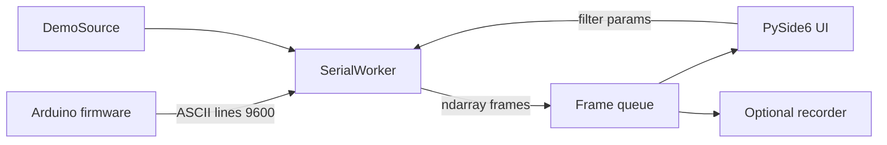

# Analysis: Migrating the MATLAB host stack to Python

> **Context:** After the 2026 firmware/docs modernization, the remaining paid dependency is MATLAB (plus Image Processing Toolbox for `medfilt2`). This note assesses impact, losses, UI choices, a modern architecture, and whether the migration is worth doing.

---

## 1. Verdict

**Yes — migrate. It is worth it, and the functional risk is low.**

> **Implementation status (2026):** Completed under `python/`. MATLAB sources archived at
> `docs/archive/matlab-2015/`. Use `mlx90620 gui` / `mlx90620 capture`.


The host side is a thin serial client + heatmap UI (~750 lines of `.m`, two GUIDE `.fig` files). It does **not** rely on distinctive MATLAB capabilities (Simulink, Control Toolbox, symbolic math, proprietary solvers). Everything it does is routine in the scientific Python stack, and Python removes a paid runtime from the project.

Recommended direction:

| Layer | Choice |
|-------|--------|
| Language | Python 3.11+ |
| Core libs | `numpy`, `scipy`, `pyserial`, `Pillow` |
| Desktop UI | **PySide6 + pyqtgraph** (primary recommendation) |
| Formatting / lint | **Ruff** (PEP 8 + isort rules) + **Black** |
| Packaging | `pyproject.toml` + optional `uv`/`pip` |
| Tests | `pytest` on pure logic + demo-mode UI smoke (headless where possible) |

Keep the **Arduino serial protocol unchanged** so firmware and Python can land independently.

---

## 2. What MATLAB actually does today

| Concern | Current MATLAB | Python equivalent |
|---------|----------------|-------------------|
| Serial I/O | `serialport` / `readline` | `pyserial` (`serial.Serial`) |
| Frame reshape | 16×4 matrix assembly | `numpy` |
| Upscale | `kron(x, ones(n))` | `numpy.kron` or `np.repeat` |
| Denoise | `medfilt2` (**Image Processing Toolbox**) | `scipy.ndimage.median_filter` |
| Display | GUIDE + `imagesc` + `colorbar` | UI toolkit + heatmap widget |
| Demo mode | `mlx90620.demoFrame` | same math in NumPy |
| Scan mosaic | marker ≤ −300 + tile assembly | identical protocol parsing |
| PNG export | `imwrite` / `getframe` | `Pillow` / widget grab |

**Paid / awkward pieces today**

1. MATLAB itself  
2. Image Processing Toolbox (`medfilt2`)  
3. GUIDE (legacy; App Designer would be another rewrite anyway)

There is no hidden MATLAB-only algorithm in this repo.

---

## 3. Impact assessment

### 3.1 What you gain

- **No license** for casual rebuilds, CI, or other contributors  
- **CI can exercise the host stack** (unit tests + optional headless GUI smoke); MATLAB never ran in Actions  
- **One language** you already use daily  
- Chance to **fix the architecture**: the GUIDE loops busy-wait on the UI thread (`while BytesAvailable == 0`), which is fragile; Python should not copy that  
- Formatting/linting with Black/Ruff is mature and already fits the modernization style of the firmware side  

### 3.2 What you lose (honest)

| Loss | Severity | Mitigation |
|------|----------|------------|
| Pixel-identical GUIDE layout | Low | Rebuild a cleaner UI; keep the same controls (Start/Stop, expansion, median radius, dual heatmaps) |
| Bit-identical `medfilt2` borders | Very low | Document `scipy` median filter; add a golden-frame unit test |
| MATLAB users without Python | Low | Project is personal/historical; document `python -m mlx90620` |
| Existing muscle memory / scripts | Low | Thin CLI + same env vars (`MLX90620_PORT`, demo flag) |

**No meaningful scientific capability is lost.**

### 3.3 Effort (technical, not calendar)

| Workstream | Nature |
|------------|--------|
| Core package (serial, parse, filter, mosaic, demo) | Small, highly testable |
| Realtime GUI | Medium (threading + heatmap updates) |
| Scan GUI | Medium (same + mosaic state) |
| Docs / CI / formatters | Small |
| Delete or archive `matlab/` | Trivial once parity is signed off |

Firmware is untouched if the serial contract stays stable (`docs/BUILD.md`).

---

## 4. Is it “easy”? Serial and filtering specifically

**Yes.**

- **Serial:** `pyserial` is the de-facto standard; LF-terminated ASCII floats at 9600 baud are trivial. Handle Uno auto-reset with a short post-open delay (as MATLAB already does).  
- **Filter:** `scipy.ndimage.median_filter(frame, size=r)` after nearest-neighbor upscale replaces `medfilt2` + `kron`.  
- **Heatmaps:** any of matplotlib / pyqtgraph / Dear PyGui can show a 16×4 (or upscaled) float grid with a colorbar and fixed clim (e.g. 15–40 °C).

The hard part is not libraries — it is **not blocking the UI** while reading serial.

---

## 5. Better paradigm than a 1:1 GUIDE port

Do **not** translate the GUIDE `while` loops line-by-line. Use a small pipeline:

```text
[SerialWorker thread] --frames--> [Queue] --frames--> [UI / plot widgets]
                                      |
                                      +--> optional PNG recorder
```

Principles:

1. **Worker thread (or asyncio + to_thread)** owns the port; UI thread never busy-waits.  
2. **Immutable frames** (`numpy.ndarray`) cross the queue; UI only renders.  
3. **Start/Stop** start/join the worker; closing the window always stops the worker (fixes the classic “COM stuck until MATLAB restart” failure mode from the 2015 user guide).  
4. **Shared core, two frontends** (optional): CLI (`python -m mlx90620.realtime`) for headless/CI, GUI for interactive use.  
5. **Modes as strategies:** `RealtimeSource` vs `ScanSource` vs `DemoSource` behind one protocol.  

Optional later upgrade (not required for v1): binary framing or a one-line JSON banner at connect for versioning — only if you intentionally break the 2015 ASCII contract.



---

## 6. UI library proposal

### Options compared

| Stack | Pros | Cons | Fit for this project |
|-------|------|------|----------------------|
| **Matplotlib in Qt/Tk** | Familiar; OK static heatmaps | Slow/janky for live updates; easy to recreate GUIDE’s blocking habits | Acceptable MVP, weak long-term |
| **PyQtGraph + PySide6** | Built for realtime plots/images; OpenGL path; solid desktop apps | Qt learning curve | **Best default** |
| **Dear PyGui** | Very fast GPU UI | Different look; less “standard desktop”; smaller ecosystem for serial tools | Good if you want a modern instrument panel |
| **CustomTkinter + Matplotlib** | Pretty and simple | Still matplotlib refresh limits | Fine for a quick clone of GUIDE |
| **Streamlit / NiceGUI** | Fast to sketch | Wrong model for exclusive serial device + Start/Stop lifecycle | Not recommended as primary |
| **Kivy** | Touch-oriented | Heavier than needed | Skip |

### Recommendation

**Ship v1 with PySide6 + pyqtgraph.**

Why that pair:

- Heatmaps updating a few times per second are pyqtgraph’s sweet spot (ImageItem + ColorBar).  
- Widgets (port combo, Start/Stop, spinboxes for expansion/radius, status label) are natural in Qt.  
- Matches a “lab instrument” feel better than a notebook-style Matplotlib window.  
- Same stack scales if you later add a rolling temperature plot or histogram.

Use Matplotlib only for **offline** figures in docs/notebooks if desired — not as the live UI engine.

**Layout (keep the 2015 mental model, modernize chrome):**

- Left: raw frame heatmap  
- Right: filtered heatmap  
- Bottom/side: port, baud (read-only 9600), expansion \(n\), median radius \(r\), Start / Stop  
- Scan mode: extra tile coordinate label + mosaic view when complete  

One app with a mode selector (`Realtime` | `Scan`) is better than two near-duplicate GUIDE figures.

---

## 7. Formatting and quality bar (Python)

Align with (and eventually replace) the MATLAB MISS_HIT lane:

| Tool | Role |
|------|------|
| **Black** | Opinionated formatter |
| **Ruff** | Lint + import sorting (replaces flake8/pep8 + isort in practice) |
| **pytest** | Unit tests for filter, marker decode, demo frames |
| Optional **mypy** | Gradual typing on the core package |

Suggested layout:

```text
python/
  pyproject.toml
  src/mlx90620_host/
    serial_io.py
    protocol.py
    filter.py
    demo.py
    sources.py
  src/mlx90620_app/          # GUI entry
    main.py
    main_window.py
    worker.py
  tests/
scripts/                     # extend format.sh / lint.sh
```

CI jobs: `ruff check`, `black --check`, `pytest`, keep firmware jobs as they are.

---

## 8. Proposed migration plan

### Phase A — Core library (no GUI)

1. Create `python/` package with protocol parse, filter, demo, serial open.  
2. Golden tests: marker decode, mosaic assembly, filter smoke test.  
3. CLI: read N frames and print stats / save PNG (works in CI with demo source).

**Exit criteria:** `pytest` green; demo CLI produces a PNG artifact in Actions.

### Phase B — GUI v1

1. PySide6 shell + pyqtgraph dual heatmaps.  
2. SerialWorker + queue; Start/Stop; env/`argparse` for port.  
3. Realtime mode parity with MATLAB UI.  
4. Scan mode mosaic.

**Exit criteria:** manual check on hardware + demo mode; window close releases the port.

### Phase C — Cut over

1. Point README / BUILD / USER_GUIDE at Python.  
2. Move `matlab/` to `docs/archive/matlab-2015/` (or delete after one release).  
3. Remove MISS_HIT from CI; keep Black/Ruff.  
4. Update `CONTRIBUTING.md` / `AGENTS.md`.

### Phase D — Optional polish

- Tray/status improvements, colormap picker, recording toggle  
- Type hints + mypy  
- Packaged entry point (`pipx install .` / `uvx`)

---

## 9. Risk register

| Risk | Mitigation |
|------|------------|
| Serial framing edge cases on Windows COM | Keep ASCII protocol; integration test with a fake serial (`pty` / `com0com` / pytest monkeypatch) |
| UI freeze copied from GUIDE | Enforce worker-thread rule in AGENTS/CONTRIBUTING |
| SciPy median vs `medfilt2` visual delta | Side-by-side screenshot once on real data; accept minor border differences |
| Qt install pain on some Linux | Document `PySide6` wheels; CI uses official wheels |

---

## 10. Recommendation summary

1. **Migrate fully to Python** — low loss, high leverage, removes the last paid host dependency.  
2. **Do not 1:1-port GUIDE**; introduce a serial worker + queue and a single dual-mode app.  
3. **UI:** PySide6 + **pyqtgraph** (not live Matplotlib).  
4. **Tooling:** Black + Ruff (+ pytest), wired like the existing firmware CI.  
5. **Firmware:** leave alone; treat the serial contract as the API boundary.  
6. **Archive MATLAB** after Python parity; do not maintain two host stacks long-term.

If you green-light implementation, the natural first PR is **Phase A** (core + tests + formatters) with no GUI yet — small, reviewable, and immediately useful in CI.
